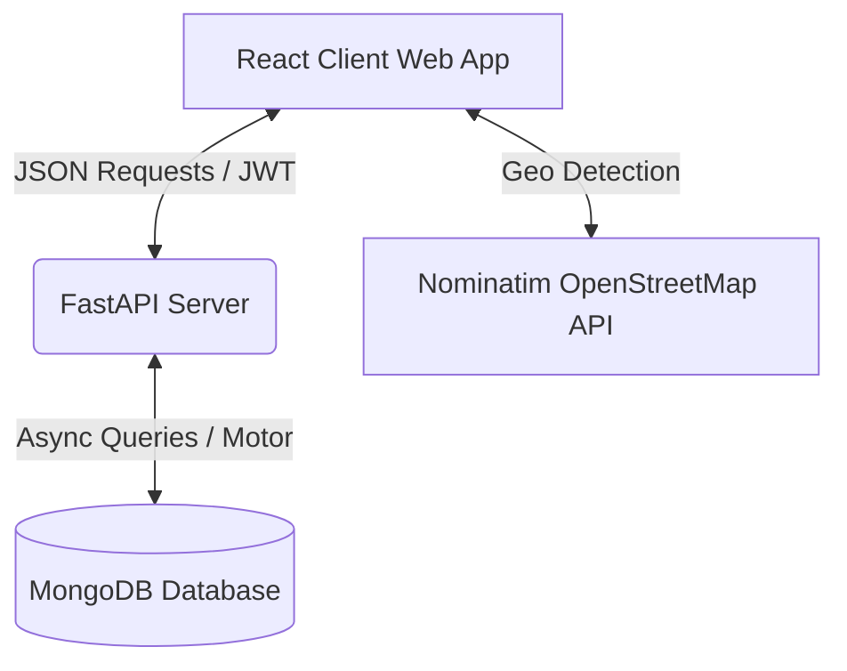

# 🌐 Right Ads Digital — Premium Business Listing Directory

[](https://vitejs.dev/)
[](https://react.dev/)
[](https://tailwindcss.com/)
[](https://fastapi.tiangolo.com/)
[](https://www.mongodb.com/)
[](https://jwt.io/)

A premium, modern, and high-performance local business listing directory website (akin to *Justdial* or *Yelp*) featuring an ultra-sleek React SPA frontend powered by a robust asynchronous FastAPI & MongoDB backend. 

---

## 🎨 User Experience Highlights

Right Ads Digital has been designed to prioritize visual elegance, seamless interactivity, and speed:
* **Glassmorphic Hero Banner**: Immersive background slide animations (powered by Unsplash CDN) and interactive auto-slider controls.
* **Geolocalized Search**: Integrated Nominatim OpenStreetMap API for automated client-side pincode and city detection.
* **Smooth Micro-Animations**: Built with Framer Motion to provide high-end, responsive card hover states, fade-in loading, and active transitions.
* **Dual theme controls & layouts**: Completely responsive grids tailored perfectly from mobile screen widths up to 1280px desktops.

---

## ✨ Features Checklist

### 💻 Public Portal & Customer Features
* 🔍 **Smart Multi-Parametric Search**: Locate businesses quickly by custom text queries, categories, city, or pincode.
* 🏷️ **Trending & Quick Categories**: Speed up lookup using smart shortcut tags (e.g., Restaurants, Gyms, Spas) and subcategories.
* 🗺️ **Detailed Business Profiles**: Review operating hours, specific services, brand alliances, star ratings, and contact info.
* 📨 **Lead / Quote Generator**: Directly request quotes/leads from businesses via interactive pop-up forms that immediately update the database.
* 🔖 **Favorites & Bookmarks**: Save listings to a personalized dashboard for easy access later (requires user login).

### 🏢 Partner & Business Listing Portal
* ➕ **Listing Submissions**: Self-service wizard for business owners to submit names, contacts, descriptions, services, logo URLs, and branding metadata.
* 📊 **Lead Center**: Real-time customer lead inquiries routed specifically to listing owners.

### 🛡️ Admin Management Panel
* 📉 **Interactive Analytics HUD**: Real-time stats on registered users, active businesses, pending applications, and generated leads.
* 🗂️ **Categories Organizer**: Complete CRUD operations for categories (with icon classes, custom slugs, and design colors).
* 📝 **Application Verification Workflows**: Approve, reject, or put new business listings on hold with a single click.
* 💼 **Global Leads Tracker**: Complete administrative oversight over all inquiry transactions occurring across the application.

---

## 🏗️ Architecture Overview



### Port Mapping & Connections

| Component | Target URL / Address | Protocol / Driver |
| :--- | :--- | :--- |
| **Frontend App** | `http://localhost:5173` | HTTP (Vite Dev Server) |
| **Backend API** | `http://localhost:8000` | REST API (Uvicorn / FastAPI) |
| **Interactive Docs** | `http://localhost:8000/docs` | Swagger OpenAPIs |
| **Database Engine** | `mongodb://localhost:27017` | MongoDB Community Server |

---

## 📂 Project Structure

```text
├── backend/
│   ├── app/
│   │   ├── auth/          # Password hashing, user validation, and JWT generation
│   │   ├── models/        # Pydantic schemas (Data validation & Serialization)
│   │   ├── routers/       # Route endpoints (Auth, Admin, Businesses, Leads, Categories, Stats)
│   │   ├── config.py      # App configurations (.env file loader)
│   │   ├── database.py    # Asynchronous MongoDB Connection Setup (Motor Client)
│   │   ├── main.py        # FastAPI Initialization, CORS middleware, and Lifespan seeding
│   │   └── seed.py        # Automated Database Seeder (Seeds 19 Categories on first launch)
│   ├── requirements.txt   # Backend Pip Dependencies
│   └── run.py             # Server runner script
│
├── Frontend/
│   ├── src/
│   │   ├── components/    # Common UI elements (Navbar, Footer, Skeletons, Business Cards)
│   │   ├── context/       # Auth state sharing context across the React app
│   │   ├── data/          # Frontend static mock structures and assets
│   │   ├── pages/         # Screen views (Home, CategoryBrowse, Dashboard, Admin, SearchResults)
│   │   ├── services/      # Axios endpoints connecting directly to Backend router services
│   │   └── App.jsx        # Routing configuration & client entry
│   ├── package.json       # React dependencies and scripts
│   └── vite.config.js     # Bundler configuration
```

---

## 🚀 Quick Start Guide

### 📋 Prerequisites
Ensure the following are installed and running locally:
* **Node.js** (v18.0 or higher recommended)
* **Python** (v3.9 or higher recommended)
* **MongoDB Community Server** (running locally on port `27017`)

---

### 📥 Step 1: Clone and Prepare
Open your terminal inside the project directory:
```bash
git clone https://github.com/xxKrishna2609xx/Business-Listing-Website.git
cd Business-Listing-Website
```

---

### 🔌 Step 2: Start the MongoDB Server
Verify MongoDB is running locally on port `27017`.
* **Windows**: Open `Services.msc`, select **MongoDB Server**, and click **Start**.
* **macOS**: `brew services start mongodb-community`
* **Linux**: `sudo systemctl start mongod`

---

### 🐍 Step 3: Launch the Backend Server

1. Navigate to the `backend` folder:
   ```bash
   cd backend
   ```

2. Create a virtual environment and activate it:
   ```bash
   # Windows (CMD)
   python -m venv venv
   venv\Scripts\activate

   # Windows (PowerShell)
   python -m venv venv
   .\venv\Scripts\Activate.ps1

   # macOS/Linux
   python3 -m venv venv
   source venv/bin/activate
   ```

3. Install the dependencies:
   ```bash
   pip install -r requirements.txt
   ```

4. Launch the application:
   ```bash
   python run.py
   ```

> [!NOTE]
> On the first startup, the server automatically reads the `seed.py` file and populates MongoDB with initial mock categories, default admin logins, businesses, and test leads so you can explore immediately!

---

### 💻 Step 4: Launch the Frontend Client

1. Open a new terminal window at the root of the project and navigate to `Frontend`:
   ```bash
   cd Frontend
   ```

2. Install dependencies:
   ```bash
   npm install
   ```

3. Start the Vite development server:
   ```bash
   npm run dev
   ```

4. Access the portal at **`http://localhost:5173`**.

---

## 🔐 Default Admin Credentials

For full management portal access, log in using the pre-seeded admin credentials:

> [!IMPORTANT]
> * **Admin Email**: `admin@rightads.digital`
> * **Admin Password**: `Admin@123`
> 
> *To access: Sign in with the details above, click the profile circle in the top right, and select **Admin Panel**.*

---

## 🛠️ Verification & Test Plan

### Automatic API Testing
Verify all server endpoints return successfully by visiting:
* **Interactive API Playground**: [http://localhost:8000/docs](http://localhost:8000/docs) (Swagger UI)
* **Alternative Schema Spec**: [http://localhost:8000/redoc](http://localhost:8000/redoc) (ReDoc)

### Frontend Verification
Confirm the client successfully connects:
1. Try performing a search query for `"Tikka & Curry"` in the location `"Hyderabad"`.
2. Access the **Browse Categories** section and click on **Restaurants**.
3. Attempt to submit a new listing request via **List Your Business** and check if it appears in the **Admin Panel** under *Applications*.
