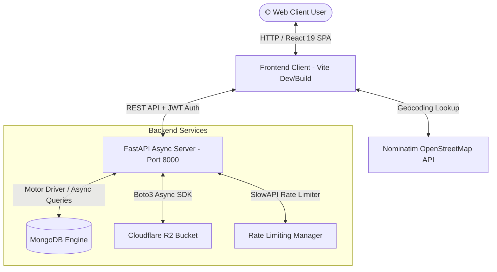

# 🏢 Right Ads Digital — Enterprise Local Business Directory & Platform

[](https://fastapi.tiangolo.com/)
[](https://react.dev/)
[](https://vitejs.dev/)
[](https://tailwindcss.com/)
[](https://www.mongodb.com/)
[](https://jwt.io/)
[](https://www.cloudflare.com/products/r2/)

A high-performance, enterprise-grade local business listing directory platform (akin to *Justdial*, *Yelp*, or *YellowPages*). Engineered with a high-speed **React 19 SPA** frontend and powered by an asynchronous **FastAPI & MongoDB** backend with **Cloudflare R2** media storage, dynamic pincode geolocalization, and role-based administration.

---

## 📋 Table of Contents

- [✨ Key Features](#-key-features)
- [⚙️ Core Technology Stack](#️-core-technology-stack)
- [🏗️ System Architecture](#️-system-architecture)
- [📂 Project Directory Structure](#-project-directory-structure)
- [🚀 Local Server Start Guide](#-local-server-start-guide)
  - [Prerequisites](#1-prerequisites)
  - [Step 1: Backend Setup (FastAPI)](#step-1-backend-setup-fastapi)
  - [Step 2: Frontend Setup (React + Vite)](#step-2-frontend-setup-react--vite)
- [🛡️ Production Deployment Guide](#️-production-deployment-guide)
- [🔐 Environment Configuration & Security](#-environment-configuration--security)
- [🔌 API Route Reference](#-api-route-reference)
- [🧪 Testing & Interactive API Docs](#-testing--interactive-api-docs)
- [📄 License & Author](#-license--author)

---

## ✨ Key Features

### 🌐 End-User Experience & Search
* **Glassmorphic Hero Interface**: Dynamic background slide animations and auto-slider powered by Framer Motion.
* **Geolocalized Pincode Detection**: Real-time geolocation lookup integration (via Nominatim OpenStreetMap API) for automatic pincode and city discovery.
* **Instant Filter & Search**: Search businesses by title, tags, location, or pincode with debounced client-side and server-side filtering.
* **Category Hub**: Categorized directory browsing spanning IT Services, Healthcare, Marketing, Restaurants, Education, Real Estate, and more.
* **Interactive Reviews & Ratings**: User rating system with verified customer reviews and star summaries.
* **Bookmarks & Favorites**: Saved listing bookmarks linked directly to user accounts.

### 💼 Business Owner Portal
* **Business Listing Submission**: Multi-step wizard to register verified business details, contact information, operating hours, and location data.
* **Cloudflare R2 Image Uploads**: Fast object storage for high-resolution business logos, cover photos, and gallery images with file size & format validation.
* **Lead Capturing**: Inquiry forms enabling prospective customers to contact businesses directly.

### 🛡️ Admin Management Dashboard
* **Metrics & Analytics**: Overview of system statistics (total verified listings, pending applications, active users, total leads).
* **Listing Verification Workflow**: Approve, reject, or request revisions on submitted business applications.
* **Category Manager**: Add, edit, or remove business categories with custom iconography.
* **Lead & Review Moderation**: Complete administrative control over submitted leads and reviews.

### 🔒 Enterprise Security & Scalability
* **Asynchronous Motor DB Engine**: Non-blocking MongoDB queries utilizing Python `asyncio` for maximum concurrency.
* **Stateless JWT Authentication**: Access and Refresh Token pair mechanism signed with `python-jose` and `bcrypt` password hashing.
* **SlowAPI Rate Limiting**: Endpoint protection against DDoS and abuse with fine-grained rate limits (Auth, Search, Upload, Admin).
* **Security Headers & CORS**: Custom security middleware enforcing trusted host checks, HSTS, XSS protection, and explicit CORS origin control.

---

## ⚙️ Core Technology Stack

| Layer | Technologies & Libraries | Description |
| :--- | :--- | :--- |
| **Frontend Client** | [React v19.2.6](https://react.dev/), [Vite v8.0.12](https://vitejs.dev/), [React Router v7](https://reactrouter.com/) | Modern Single-Page Application framework built for fast HMR and optimized DOM updates. |
| **Styling & Icons** | [Tailwind CSS v4.3.1](https://tailwindcss.com/), [Framer Motion](https://www.framer.com/motion/), [Lucide React](https://lucide.dev/) | Utility-first styling engine with fluid spring micro-animations and clean SVG icons. |
| **State & HTTP** | [Axios](https://axios-http.com/), React Context API, [React Hot Toast](https://react-hot-toast.com/) | Promise-based API client with interceptors, unified auth context, and sleek toast alerts. |
| **Backend API** | [FastAPI v0.111.0](https://fastapi.tiangolo.com/), [Uvicorn v0.29.0](https://www.uvicorn.org/), [Pydantic v2](https://docs.pydantic.dev/) | High-speed ASGI Python framework with strict data validation schemas. |
| **Database** | [MongoDB](https://www.mongodb.com/), [Motor v3.4.0](https://motor.readthedocs.io/), [PyMongo](https://pymongo.readthedocs.io/) | Asynchronous NoSQL database driver supporting concurrent geospatial & text indexing. |
| **Storage & Auth** | [Cloudflare R2](https://www.cloudflare.com/products/r2/) (Boto3), [JWT](https://jwt.io/), [Passlib/Bcrypt](https://passlib.readthedocs.io/) | Cloud object storage for media assets and secure JWT-based stateless user authorization. |
| **Security & Limits** | [SlowAPI](https://slowapi.readthedocs.io/), Custom Security Headers, Trusted Host | Multi-tier rate limiting and security headers middleware stack. |

---

## 🏗️ System Architecture



### Network Port & Interface Mapping

| Component | Default Address | Protocol / Purpose |
| :--- | :--- | :--- |
| **Frontend Web App** | `http://localhost:5173` | React SPA (Vite Development Server) |
| **Backend REST API** | `http://localhost:8000` | FastAPI ASGI Server (Uvicorn) |
| **Interactive API Docs** | `http://localhost:8000/docs` | Swagger OpenAPI Interactive Explorer |
| **ReDoc API Spec** | `http://localhost:8000/redoc` | OpenAPI Human-Readable Spec |
| **Database Instance** | `mongodb://localhost:27017` | MongoDB Community / Atlas Cluster |

---

## 📂 Project Directory Structure

```text
.
├── backend/
│   ├── app/
│   │   ├── auth/            # Hashing utilities, OAuth2 schemes, and JWT generation
│   │   ├── core/            # Config setting loaders, database connections, Redis & loggers
│   │   ├── exceptions/      # Global exception handlers & standardized error schemas
│   │   ├── middleware/      # Rate limiting, security headers, logging & request IDs
│   │   ├── models/          # Pydantic schemas for data validation and API payloads
│   │   ├── routers/         # API Route Handlers (Auth, Business, Admin, Lead, Reviews, Uploads)
│   │   ├── services/        # Business logic & Cloudflare R2 object storage integration
│   │   ├── main.py          # FastAPI application factory, CORS, and lifecycle events
│   │   └── seed.py          # Automated database seeder (Categories, admin, mock listings)
│   ├── indexes.py           # MongoDB index creation script (Text search, unique fields)
│   ├── requirements.txt     # Backend Python Pip dependencies
│   ├── run.py               # Uvicorn entry point runner script
│   └── .env.example         # Environment variables configuration template
│
├── Frontend/
│   ├── public/              # Static public assets, favicons, and manifest files
│   ├── src/
│   │   ├── components/      # Reusable UI elements (Navbar, Footer, Cards, Modals, Loaders)
│   │   ├── context/         # React Context for global Auth state and user session
│   │   ├── data/            # Static mock categories and fallback initial data
│   │   ├── pages/           # Page views (Home, Search, Categories, Admin, Business Details)
│   │   ├── services/        # Axios API client services connecting to FastAPI endpoints
│   │   ├── App.jsx          # Route definitions and layout wrappers
│   │   └── main.jsx         # Vite entry point and DOM renderer
│   ├── package.json         # NPM scripts and dependencies
│   ├── vite.config.js       # Vite bundler & proxy configuration
│   └── .env.example         # Frontend environment variables template
│
└── README.md                # Project documentation
```

---

## 🚀 Local Server Start Guide

Follow these step-by-step instructions to get the application running on your local development machine.

### 1. Prerequisites

Before starting, ensure you have the following installed:
* **Node.js** (`v18.0.0` or higher) & **npm** (`v9.0.0` or higher) — [Download Node.js](https://nodejs.org/)
* **Python** (`v3.9.0` or higher) & **pip** — [Download Python](https://www.python.org/)
* **MongoDB**: Running locally on port `27017` OR a valid **MongoDB Atlas Cloud Connection String**.

---

### Step 1: Backend Setup (FastAPI)

1. **Open a terminal** and navigate to the `backend` directory:
   ```bash
   cd backend
   ```

2. **Create your `.env` configuration file**:
   Copy the provided `.env.example` file to create `.env`:
   * **Windows (PowerShell)**:
     ```powershell
     Copy-Item .env.example .env
     ```
   * **Linux / macOS**:
     ```bash
     cp .env.example .env
     ```

3. **Configure your Environment Variables**:
   Open `backend/.env` in your code editor and update the database URI and secret keys.

   > [!WARNING]
   > **DO NOT** commit your `.env` file to version control. Keep your secret keys and database passwords private!

4. **Create & Activate a Python Virtual Environment**:
   * **Windows (PowerShell)**:
     ```powershell
     python -m venv venv
     .\venv\Scripts\Activate.ps1
     ```
   * **Windows (CMD)**:
     ```cmd
     python -m venv venv
     call venv\Scripts\activate.bat
     ```
   * **Linux / macOS**:
     ```bash
     python3 -m venv venv
     source venv/bin/activate
     ```

5. **Install Required Pip Packages**:
   ```bash
   pip install --upgrade pip
   pip install -r requirements.txt
   ```

6. **Start the FastAPI Development Server**:
   You can start the server using either `run.py` or direct `uvicorn`:
   ```bash
   python run.py
   ```
   *Alternatively, run with custom reload options:*
   ```bash
   uvicorn main:app --host 0.0.0.0 --port 8000 --reload
   ```

7. **Verify Backend Status**:
   - Backend API base URL: **`http://localhost:8000`**
   - Health check: **`http://localhost:8000/health`**
   - Interactive Swagger Docs: **`http://localhost:8000/docs`**

> [!NOTE]
> Upon initial startup, the backend automatically initializes database indexes and populates initial business categories, admin accounts, and sample listings!

---

### Step 2: Frontend Setup (React + Vite)

1. **Open a new terminal window** and navigate to the `Frontend` directory:
   ```bash
   cd Frontend
   ```

2. **Create your `.env` configuration file**:
   Copy `.env.example` to `.env`:
   * **Windows (PowerShell)**:
     ```powershell
     Copy-Item .env.example .env
     ```
   * **Linux / macOS**:
     ```bash
     cp .env.example .env
     ```

3. **Install NPM Dependencies**:
   ```bash
   npm install
   ```

4. **Start the Vite Development Server**:
   ```bash
   npm run dev
   ```

5. **Access the Frontend Application**:
   Open your browser and navigate to **`http://localhost:5173`**.

---

## 🛡️ Production Deployment Guide

For hosting in production environments (e.g., AWS EC2, DigitalOcean, Vercel, or Render):

### 1. Backend Production Setup (Gunicorn + Uvicorn Workers)
Do not use `--reload` in production. Instead, run with Gunicorn process manager:
```bash
pip install gunicorn
gunicorn -w 4 -k uvicorn.workers.UvicornWorker main:app --bind 0.0.0.0:8000
```

### 2. Frontend Production Build
Compile optimized static files:
```bash
cd Frontend
npm run build
```
The output files will be generated in `Frontend/dist`. Preview the production build locally:
```bash
npm run preview
```

### 3. Sample Nginx Reverse Proxy Configuration
```nginx
server {
    listen 80;
    server_name yourdomain.com;

    # Frontend Static Site
    location / {
        root /var/www/Frontend/dist;
        try_files $uri $uri/ /index.html;
    }

    # Backend API Proxy
    location /api/ {
        proxy_pass http://127.0.0.1:8000;
        proxy_set_header Host $host;
        proxy_set_header X-Real-IP $remote_addr;
        proxy_set_header X-Forwarded-For $proxy_add_x_forwarded_for;
    }
}
```

---

## 🔐 Environment Configuration & Security

> [!IMPORTANT]
> **Zero Secret Leakage Policy**: Never commit `.env` files containing real production database passwords, JWT secret keys, or Cloudflare credentials to GitHub. Always use standard placeholder values in sample files!

### Backend `.env` Variable Matrix

| Variable | Description | Safe Example / Default | Required |
| :--- | :--- | :--- | :---: |
| `ENVIRONMENT` | Runtime environment mode | `development` / `production` | Yes |
| `HOST` | Server binding host IP | `0.0.0.0` | Yes |
| `PORT` | Server listening port | `8000` | Yes |
| `MONGO_URI` | MongoDB connection URI string | `mongodb://localhost:27017` | Yes |
| `DATABASE_NAME` | MongoDB database name | `nearlly_db` | Yes |
| `SECRET_KEY` | JWT Access Token Signing Key | *Generate via `secrets.token_urlsafe(32)`* | Yes |
| `REFRESH_SECRET_KEY` | JWT Refresh Token Signing Key | *Generate via `secrets.token_urlsafe(32)`* | Yes |
| `ALGORITHM` | JWT Signature Cryptographic Algorithm | `HS256` | Yes |
| `R2_ACCOUNT_ID` | Cloudflare R2 Account Identifier | `your_r2_account_id` | Optional |
| `R2_ACCESS_KEY_ID` | Cloudflare R2 Access Key | `your_r2_access_key` | Optional |
| `R2_SECRET_ACCESS_KEY` | Cloudflare R2 Secret Access Key | `your_r2_secret_key` | Optional |
| `R2_BUCKET_NAME` | Cloudflare R2 Storage Bucket Name | `nearlly-images` | Optional |
| `R2_PUBLIC_URL` | Public CDN URL for Cloudflare Bucket | `https://your-bucket.r2.dev` | Optional |
| `USE_RATE_LIMITING` | Enable SlowAPI request rate limiting | `true` | Yes |
| `ADMIN_EMAIL` | Default Admin Email for Seed Script | `admin@example.com` | Yes |
| `ADMIN_PASSWORD` | Default Admin Password for Seed Script | `SecureAdminPassword123!` | Yes |

---

## 🔌 API Route Reference

The backend provides RESTful endpoints organized under the following router modules:

### 🔐 Authentication (`/api/auth`)
* `POST /api/auth/register` — Register a new user account.
* `POST /api/auth/login` — Login user and obtain Access & Refresh JWT tokens.
* `POST /api/auth/refresh` — Refresh expired JWT access token.
* `GET /api/auth/me` — Retrieve current authenticated user profile.

### 🏪 Business Listings (`/api/business`)
* `GET /api/business` — List & search verified businesses with pagination and city/pincode filters.
* `GET /api/business/{id}` — Get detailed business profile by ID.
* `POST /api/business` — Submit a new business listing application.
* `PUT /api/business/{id}` — Update business details (Owner or Admin).
* `DELETE /api/business/{id}` — Remove business listing.

### 📂 Categories (`/api/categories`)
* `GET /api/categories` — Get all business categories and subcategories.
* `GET /api/categories/{id}` — Retrieve specific category details.

### 💬 Reviews & Leads (`/api/reviews`, `/api/leads`)
* `GET /api/reviews/business/{id}` — Fetch reviews for a business.
* `POST /api/reviews` — Submit a review and rating.
* `POST /api/leads` — Send customer inquiry lead to a business.

### 🛡️ Admin Management (`/api/admin`)
* `GET /api/admin/stats` — Get platform-wide analytics and performance metrics.
* `GET /api/admin/applications` — List pending business applications.
* `PUT /api/admin/applications/{id}/approve` — Approve business application.
* `PUT /api/admin/applications/{id}/reject` — Reject business application with feedback.

### 📤 Media Uploads (`/api/upload`)
* `POST /api/upload/image` — Upload image file to Cloudflare R2 object storage.

---

## 🧪 Testing & Interactive API Docs

FastAPI automatically generates interactive documentation endpoints:

- **Swagger UI Sandbox**: Visit [http://localhost:8000/docs](http://localhost:8000/docs) to test API requests directly in your browser.
- **ReDoc Interactive Spec**: Visit [http://localhost:8000/redoc](http://localhost:8000/redoc) for a clean API reference layout.
- **Health Diagnostic Endpoint**:
  ```bash
  curl -X GET http://localhost:8000/health
  ```
  *Expected Output:*
  ```json
  {
    "status": "healthy",
    "environment": "development",
    "version": "1.0.0"
  }
  ```

---

## 📄 License & Author

Distributed under the **MIT License**. See `LICENSE` for more details.

**Right Ads Digital** — *Empowering Local Businesses Across India.*
